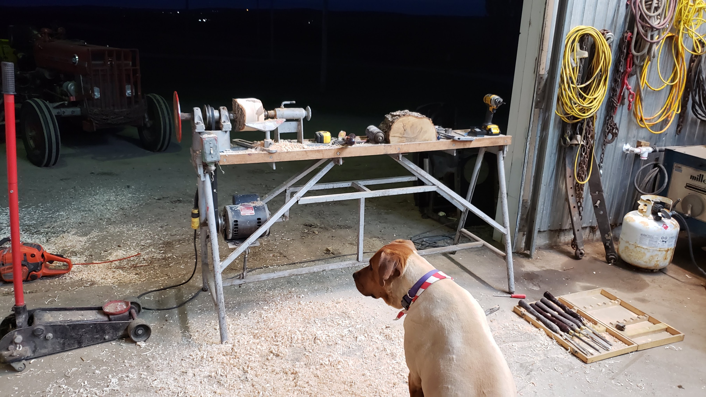

# Frédéric Bilodeau

<table>
    <tr>
        <td></td>
        <td></td>
        <td></td>
    </tr>
</table>

# Some of my projects over the years

### Capstone project - VR/AR glove with haptic feedback and finger movement restriction

#### Summer 2023 - winter 2024

Wearable, autonomous gloves with arm and hand motion sensors, designed by 8 engineering students for virtual and augmented reality. Each glove incorporates individual finger motion restriction capabilities and haptic feedback for enhanced interaction with digital environments.

- Leader of the electrical design team for various PCBs with a focus on miniaturization, ESD protection, high-speed performance, and low power efficiency
- Embedded programming on ESP32 for board bring-up and sensor configurations of ICM-20948 sensors in C++
- Design mechanical components to provide locking mechanisms for each finger and fail-safe electrical systems

#### The V2

<table>
    <tr>
        <td></td>
        <td></td>
    </tr>
</table>

#### Exposing the project at an engineering fair

#### All the boards we made

<table>
    <tr>
        <td></td>
        <td></td>
    </tr>
</table>

## OP AMP DESIGN

### Fall 2024

For my last semester of my bachelors, I chose to take on the courses on ASIC design. We sized the MOSFETs to meet the specifications, choose the layout and implement it in Cadence. We used the TSMC 180nm Tech stack.
The pdf of my presentation is [here](./images/opamp/presentation.pdf)

<table>
    <tr>
        <td></td>
        <td></td>
    </tr>
</table>
<table>
    <tr>
        <td></td>
    </tr>
</table>

### PCB Design, Spring 2024

As part of my semester, we designed in a team of 2, a 14 layers PCB with FGPA, DDR3 RAM, High Speed (LVDS) DAC and ADC, external flash and isolated power supplies. The recommended stack was 16 or 18 layers PCB.
We were the only team to finish a PCB what would work with only 14.
The link to the project [Github](https://github.com/Raesangur/UdeS_S7_APP1)

### Embedded Software Internship at Tesla, Fall 2023

- Achieved over **$2 million** in manufacturing cost savings in 2024 by optimizing the audio subsystem’s RAM requirements
  through adjustments to Linker Description Files and RAM section configurations
- Implementation in Embedded Linux and RTOS in C++ (CAN bus communication to other body controllers, housekeeping
  routines, interfacing A2B devices, error messaging and propagation)
- Development and optimization of boot-time tasks and sequences in the MCUs to reduce startup time and improve
  audio subsystem performance in C/C++
- Firmware development in the Embedded Audio team focusing on interfaces between the MCU and SHARC Core DSPs
  in C/C++
- Creation and improvement of unit tests in Python (CAN, Signal Timing, A2B, Logic analyzer interfaces) in Python
- HIL and SIL improvements (CAN, Etherloop, Input and Output timing and logging, UART, ECUs and body controllers) in Python

The pictures are not directly about my work because pictures were prohibited :).

<table>
    <tr>
        <td></td>
        <td></td>
        <td></td>
    </tr>
</table>

### FSAE 2022

This was my first time going to Michigan and I made a lot of automotive learning along the way.
I learned how to TIG weld, conventional machining and how to use the 4th axis on a CNC.
To see more of my machining experiences [Github](https://github.com/freder202/Machining)

<table>
    <tr>
        <td></td>
        <td></td>
        <td></td>
    </tr>
</table>

### Flex PCB Design, Fall 2022

As part of my internship, I Design, model, prototype and provide manufacturing specifications for a complex, multi-connector flexible printed circuit (FPC) featuring 22 bends.
I also did :

- Board bring up using Embedded Linux and Embedded Android on STM32MP1
- Extreme low power MCU optimizations involving several hardware/software combinations (**100mA to sub nA consumption**)
- **Embedded Linux development** using Buildroot / Embedded Android development using AOSP

### Batch of sensors to manufacture

As part of a part time contract, I had to manufacture around 230 of those sensors boards.
Learned a lot about manufacturing, the challenges involved behind every design decisions and how to make things simple to make a large batch of.

<table>
    <tr>
        <td></td>
        <td></td>
    </tr>
</table>

### First PCB experiences 2021 and earlier

Those are some pictures of old PCBs I made and some I found during the disassembly of electronic products

<table>
    <tr>
        <td></td>
        <td></td>
        <td></td>
        <td></td>
    </tr>
</table>

### Woodworking projects

<table>
    <tr>
        <td></td>
        <td></td>
    </tr>
    <tr>
        <td></td>
        <td></td>
    </tr>
    <tr>
        <td></td>
        <td></td>
    </tr>
</table>

